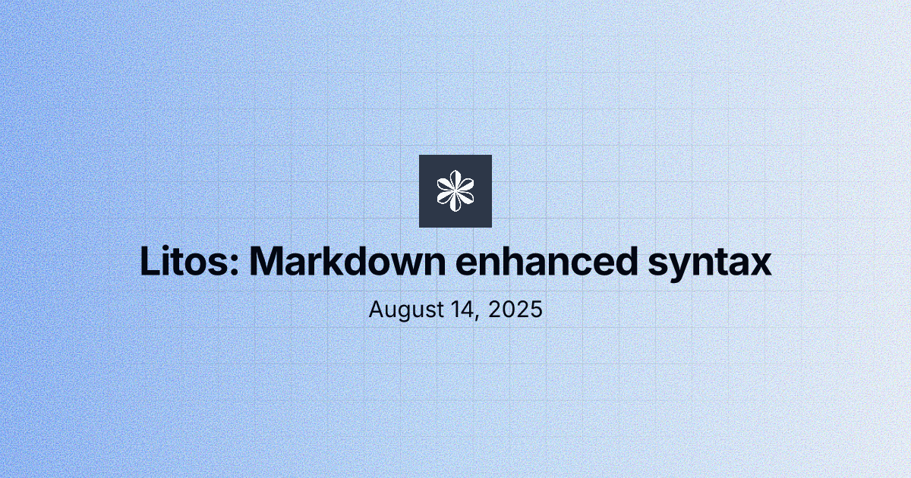
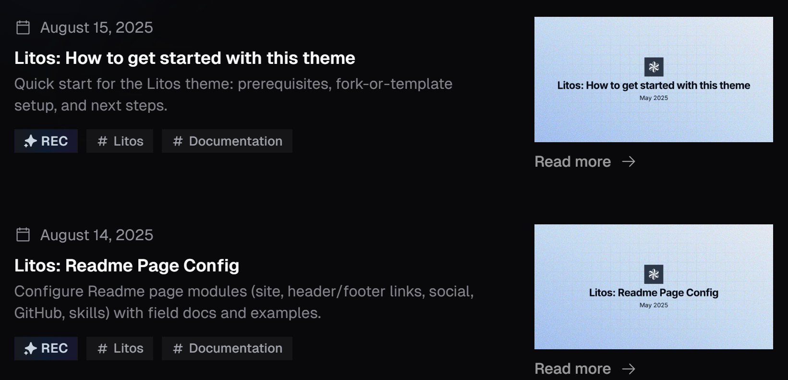
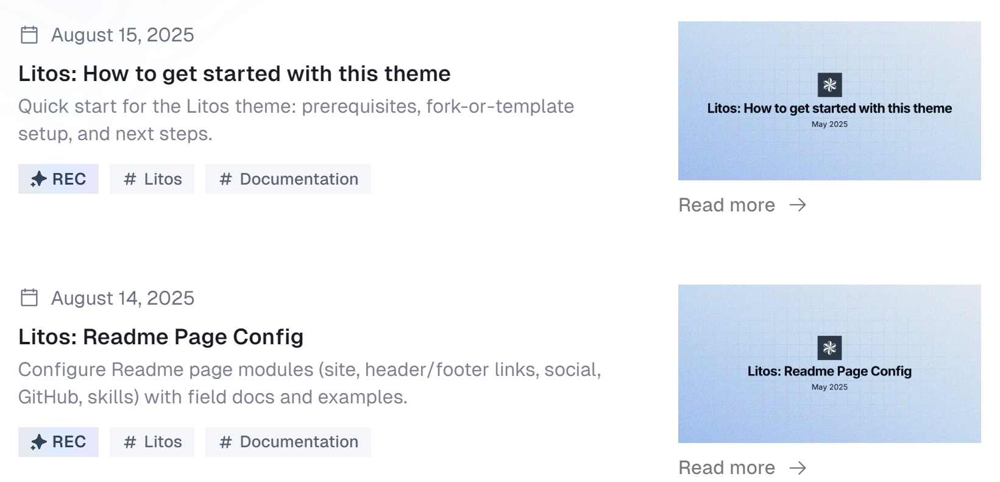

This guide has made slight changes based on the [markdown-mdx-extended-features](https://astro-antfustyle-theme.vercel.app/blog/markdown-mdx-extended-features/).

## Callouts

Supported by the :link[rehype-callouts]{id=lin-stephanie/rehype-callouts class='github'} , you can configure the plugin in `plugins/index.ts`.

If you change the `theme` configuration (default: `'vitepress'`), you will also need to update the imported CSS file in `src/styles/pro.css` (`@import 'rehype-callouts/theme/yourconfig'`).

```md
<!-- Callout type names are case-insensitive: 'Note', 'NOTE', and 'note' are equivalent. -->

<!-- vitepress -->

<!-- This is a _non-collapsible_ callout -->

> [!note]
> Note content.

> [!tip]
> Tip content.

> [!important]
> Important content.

> [!warning]
> Warning content.

> [!caution]
> Caution content.

> [!caution]- This is a **collapsible** callout
> Caution content.

> [!note]+ This is a **collapsible** callout
> Note content.
```

> [!note]
> Note `content`.

> [!tip]
> Tip `content`.

> [!important]
> Important `content`.

> [!warning]
> Warning `content`.

> [!caution]
> Caution `content`.

> [!caution]- This is a **collapsible** callout
> Caution content.

> [!note]+ This is a **collapsible** callout
> Note content.

## Fully-featured Code Blocks

Supported by :link[astro-expressive-code]{id=https://github.com/expressive-code/expressive-code/tree/main/packages/astro-expressive-code} with [@expressive-code/plugin-collapsible-sections](https://expressive-code.com/plugins/collapsible-sections/) and [@expressive-code/plugin-line-numbers](https://expressive-code.com/plugins/line-numbers/) plugins to add styling and extra functionality for code blocks.

To customize code block themes or functionality, modify the `ec.config.mjs` file at the project root after reviewing the :link[Configuring Expressive Code]{id=https://expressive-code.com/reference/configuration/}, such as [change themes](https://expressive-code.com/guides/themes/#using-bundled-themes), [enable word wrap](https://expressive-code.com/key-features/word-wrap/#wrap), or [toggle line numbers](https://expressive-code.com/plugins/line-numbers/#showlinenumbers).

Here’s a quick preview of what’s possible. Check the [detailed guide](https://expressive-code.com/key-features/syntax-highlighting/) for more info.

#### Syntax highlighting

```js title='example.md'
console.log('This code is syntax highlighted!')
```

```ansi title='ansi-example.md'
ANSI colors:
- Regular: Red Green Yellow Blue Magenta Cyan
- Bold:    Red Green Yellow Blue Magenta Cyan
- Dimmed:  Red Green Yellow Blue Magenta Cyan

256 colors (showing colors 160-177):
160 161 162 163 164 165
166 167 168 169 170 171
172 173 174 175 176 177

Full RGB colors:
ForestGreen - RGB(34, 139, 34)

Text formatting: Bold Dimmed Italic Underline
```

##### Code editor frames

```js title="my-test-file.js"
// Use `title="my-test-file.js"`
console.log('Title attribute example')
```

```ts
// src/content/index.ts
// Use `// src/content/index.ts`
console.log('File name comment example')
```

##### Terminal frames

```bash
echo "This terminal frame has no title"
```

```powershell title="PowerShell terminal example"
Write-Output "This one has a title!"
```

##### Marking full lines & line ranges

```js {1, 4, 7-8}
// Line 1 - targeted by line number
// Line 2
// Line 3
// Line 4 - targeted by line number
// Line 5
// Line 6
// Line 7 - targeted by range "7-8"
// Line 8 - targeted by range "7-8"
```

##### Selecting line marker types (mark, ins, del)

```js title="line-markers.js" del={2} ins={3-4} {6}
function demo() {
  console.log('this line is marked as deleted')
  // This line and the next one are marked as inserted
  console.log('this is the second inserted line')

  return 'this line uses the neutral default marker type'
}
```

##### Adding labels to line markers

```jsx {"1":5} del={"2":7-8} ins={"3":10-12}
// labeled-line-markers.jsx
<button role="button" {...props} value={value} className={buttonClassName} disabled={disabled} active={active}>
  {children && !active && (typeof children === 'string' ? <span>{children}</span> : children)}
</button>
```

##### Adding long labels on their own lines

```jsx {"1. Provide the value prop here:":5-6} del={"2. Remove the disabled and active states:":8-10} ins={"3. Add this to render the children inside the button:":12-15}
// labeled-line-markers.jsx
<button role="button" {...props} value={value} className={buttonClassName} disabled={disabled} active={active}>
  {children && !active && (typeof children === 'string' ? <span>{children}</span> : children)}
</button>
```

##### Using diff-like syntax

```diff
+this line will be marked as inserted
-this line will be marked as deleted
this is a regular line
```

```diff lang="js"
  function thisIsJavaScript() {
    // This entire block gets highlighted as JavaScript,
    // and we can still add diff markers to it!
-   console.log('Old code to be removed')
+   console.log('New and shiny code!')
  }
```

##### Marking individual text inside lines

```js "given text"
// Plaintext search strings
function demo() {
  // Mark any given text inside lines
  return 'Multiple matches of the given text are supported'
}
```

##### Marking individual text inside lines

```ts /ye[sp]/
// Regular expressions
console.log('The words yes and yep will be marked.')
```

```sh //ho.*//
# Regular expressions
echo "Test" > /home/test.txt
```

```ts /ye(s|p)/
// Regular expressions
If you only want to mark certain parts matched by your regular expression, you can use capture groups.

For example, the expression `/ye(s|p)/` will match yes and yep, but only mark the character s or p:
```

```ts /ye(?:s|p)/
// Regular expressions
To prevent this special treatment of capture groups, you can convert them to non-capturing groups by adding ?: after the opening parenthesis. For example:

This block uses `/ye(?:s|p)/`, which causes the full
matching words "yes" and "yep" to be marked.
```

```js "return true;" ins="inserted" del="deleted"
// Selecting inline marker types (mark, ins, del)
function demo() {
  console.log('These are inserted and deleted marker types')
  // The return statement uses the default marker type
  return true
}
```

##### Configuring word wrap per block

```js wrap
// Example with wrap
function getLongString() {
  return 'This is a very long string that will most probably not fit into the available space unless the container is extremely wide'
}
```

```js wrap=false
// Example with wrap=false
function getLongString() {
  return 'This is a very long string that will most probably not fit into the available space unless the container is extremely wide'
}
```

##### Configuring indentation of wrapped lines

```js wrap preserveIndent
// Example with preserveIndent (enabled by default)
function getLongString() {
  return 'This is a very long string that will most probably not fit into the available space unless the container is extremely wide'
}
```

```js wrap preserveIndent=false
// Example with preserveIndent=false
function getLongString() {
  return 'This is a very long string that will most probably not fit into the available space unless the container is extremely wide'
}
```

##### Collapsible sections

```js collapse={1-5, 12-14, 21-24}
// All this boilerplate setup code will be collapsed
import { someBoilerplateEngine } from '@example/some-boilerplate'
import { evenMoreBoilerplate } from '@example/even-more-boilerplate'

const engine = someBoilerplateEngine(evenMoreBoilerplate())

// This part of the code will be visible by default
engine.doSomething(1, 2, 3, calcFn)

function calcFn() {
  // You can have multiple collapsed sections
  const a = 1
  const b = 2
  const c = a + b

  // This will remain visible
  console.log(`Calculation result: ${a} + ${b} = ${c}`)
  return c
}

// All this code until the end of the block will be collapsed again
engine.closeConnection()
engine.freeMemory()
engine.shutdown({ reason: 'End of example boilerplate code' })
```

##### Displaying line numbers per block

```js showLineNumbers
// This code block will show line numbers
console.log('Greetings from line 2!')
console.log('I am on line 3')
```

```js showLineNumbers=false
// Line numbers are disabled for this block
console.log('Hello?')
console.log('Sorry, do you know what line I am on?')
```

```js showLineNumbers startLineNumber=5
// Changing the starting line number
console.log('Greetings from line 5!')
console.log('I am on line 6')
```

## Image Caption & Link

Use the [`:::image`](https://github.com/lin-stephanie/remark-directive-sugar?tab=readme-ov-file#image-) directive from :link[remark-directive-sugar]{#lin-stephanie/remark-directive-sugar .github} to wrap images in a container for captions, clickable links, and more. Customize via the `image` option in `plugins/index.ts` (`remarkDirectiveSugar`) and style under `/* :::image */` in `src/styles/pro.css`.

### image-figure

`:::image-figure[caption]{<figcaption> attrs}`: The square brackets define the `<figcaption>` text (defaults to the alt text from `` if omitted), while the curly braces are used for inline styles or supported attributes to the generated `<figcaption>` element.

`( attrs)`: Standard Markdown image with optional attributes in parentheses, enabled by :link[remark-imgattr]{#OliverSpeir/remark-imgattr .github}, for customizing the generated `` element.

`:::image-figure[caption]{<figcaption> attrs}`: The square brackets define the `<figcaption>` text (defaults to the alt text from `` if omitted), while the curly braces are used for inline styles or supported attributes to the generated `<figcaption>` element.

`( attrs)`: Standard Markdown image with optional attributes in parentheses, enabled by :link[remark-imgattr]{#OliverSpeir/remark-imgattr .github}, for customizing the generated `` element.

```md title=':::image-figure.md'
:::image-figure[This Is a **Figcaption** with _`<figure>` Attrs_]{style="text-align:center;color:orange"}

:::

:::image-figure[This is a **figcaption** with _`` attrs_.]
(style: width:600px;)
:::

<!-- 💡 Use `(class:no-zoom)` to disable zoom -->

:::image-figure[This is a **figcaption** with `class:no-zoom`.]
(class:no-zoom)
:::

<!-- 💡 If no `[caption]`, use `[alt]` as figcaption. -->

:::image-figure
![If `[caption]` not set, the alt text from `` will be used as the figcaption.](assets/cover.png)
:::

<!-- 💡 Images for light (img-light) and dark (img-dark) modes -->
<!-- ⚠️ At least one line must separate two image syntaxes (), or won't work. -->

:::image-figure[This example shows different images for light (add `class:img-light`) and dark (add `class:img-dark`) modes.]
(class:img-light)

(class:img-dark)
:::

<!-- ❌ If no text is available for the figcaption, it won't work.  -->

:::image-figure

:::
```

:::image-figure[This Is a **Figcaption** with _`<figure>` Attrs_]{style="text-align:center;color:orange"}

:::

:::image-figure[This is a **figcaption** with _`` attrs_.]
(style: width:600px;)
:::

:::image-figure[This is a **figcaption** with `class:no-zoom`.]
(class:no-zoom)
:::

:::image-figure
![If `[caption]` not set, the alt text from `` will be used as the figcaption.](assets/cover.png)
:::

:::image-figure[This example shows different images for light (add `class:img-light`) and dark (add `class:img-dark`) modes.]
(class:img-light)

(class:img-dark)
:::

> [!warning]
>
> Setting an image's `width` attribute directly may cause blurriness. [Learn more](https://github.com/Dnzzk2/Litos/discussions/17)

### image-a

The custom directive wraps an image inside a link, making it clickable.

`:::image-a{<a> attrs}`: Define the link (href), styles, or classes in the curly braces for `<a>` element.

`( attrs)`: Same as above.

```md title=':::image-a.md'
:::image-a{href="https://github.com/Dnzzk2/Litos"}

:::

:::image-a{href="https://github.com/Dnzzk2/Litos" style="display:block" .custom-class}
(style: margin-bottom: -1rem; transform:scaleX(1.1) scaleY(1.1);, loading: eager)
:::

::::image-a{href="https://github.com/Dnzzk2/Litos"}
:::image-figure[This example shows `:::image-a` wraps around `:::image-figure` (both are interchangeable).]

:::
::::

<!-- ❌ No external links provided, it won't work.-->

:::image-a

:::
```

:::image-a{href="https://github.com/Dnzzk2/Litos"}

:::

:::image-a{href="https://github.com/Dnzzk2/Litos" style="display:block" .custom-class}
(style: margin-bottom: -1rem; transform:scaleX(1.1) scaleY(1.1);, loading: eager)
:::

::::image-a{href="https://github.com/Dnzzk2/Litos"}
:::image-figure[This example shows `:::image-a` wraps around `:::image-figure` (both are interchangeable).]
(style:padding-top:1rem;)
:::
::::

### image-figure-polaroid

Polaroid style images with a border and shadow.

In order to ensure the style size on the phone, I have set a minimum width of 300px, and you can modify and expand the style in `src/styles/picture.css`.

```md title=':::image-figure-polaroid.md'
:::::image-div-polaroid
:::image-figure-polaroid[This is a **figcaption** with _`` attrs_.]

:::
:::::

:::::image-div-polaroid
:::image-figure-polaroid


cover.png
:::
:::::

:::::image-div-polaroid
:::image-figure-polaroid

:::
:::::

<!-- change style -->

:::::image-div-polaroid
:::image-figure-polaroid{style="width:500px;"}

:::
:::::
```

:::::image-div-polaroid
:::image-figure-polaroid[This is a **figcaption** with _`` attrs_.]

:::
:::::

:::::image-div-polaroid
:::image-figure-polaroid


cover.png
:::
:::::

:::::image-div-polaroid
:::image-figure-polaroid

:::
:::::

:::::image-div-polaroid
:::image-figure-polaroid{style="width:500px;"}

:::
:::::

## GitHub Card

Congratulations from :link[oopsunix]{#@oopsunix}

```md title=':::github-card.md'
::github{repo="Dnzzk2/Litos"}
```

::github{repo="Dnzzk2/Litos"}

## Video Embedding

Use the [`::video`](https://github.com/lin-stephanie/remark-directive-sugar?tab=readme-ov-file#video-) directive from :link[remark-directive-sugar]{id=lin-stephanie/remark-directive-sugar .github} for consistent video embedding across different platforms. Customize via the `video` option in `plugins/index.ts` and style under `/* ::video */` in `src/styles/pro.css`.

Say `example.md` contains:

```md title='example.md'
<!-- Embed a YouTube video -->

::video-youtube{#gxBkghlglTg}

<!-- Embed a Bilibili video with a custom `title` attr -->

::video-bilibili[custom title]{id=BV1MC4y1c7Kv}

<!-- Embed a Vimeo video with class `no-scale` to disable scaling -->

::video-vimeo{id=912831806 class='no-scale'}

<!-- ::video-vimeo{id=912831806 .no-scale} -->

<!-- Embed a custom video URL (must use `id`, not `#`) -->

::video{id=https://www.youtube-nocookie.com/embed/gxBkghlglTg}
```

Then `example.mdx` renders as:

::video-youtube{#gxBkghlglTg}

::video-bilibili[custom title]{id=BV1MC4y1c7Kv}

::video-vimeo{id=912831806 class='no-scale'}

::video{id=https://www.youtube-nocookie.com/embed/gxBkghlglTg}

## Styled Link（`:link`）

Use the [`:link`](https://github.com/lin-stephanie/remark-directive-sugar?tab=readme-ov-file#link) directive from :link[remark-directive-sugar]{id=lin-stephanie/remark-directive-sugar .github} to add links with avatars or favicons for GitHub, npm, or custom URLs. Customize via the `link` option in `plugins/index.ts` and style under `/* :link */` in `src/styles/pro.css`.

**Link to a GitHub user or organization (prepend `id` with `@`)**

**Example 1**: `:link[Dnzzk2]{#@Dnzzk2}` links to the GitHub profile of the project maintainer, :link[Dnzzk2]{#@Dnzzk2}.

**Example 2**: `:link[Vite]{id=@vitejs}` links to the GitHub profile of the :link[Vite]{id=@vitejs} organization.

**Example 3**: `:link{#@Dnzzk2 tab=repositories}` links directly to the repositories tab of the GitHub user, like :link{#@Dnzzk2 tab=repositories}. For GitHub users, valid `tab` options: `'repositories','projects', 'packages', 'stars', 'sponsoring', 'sponsors'`.

**Example 4**: `:link{#@vitejs tab=org-people}` links directly to the people section of a GitHub organization, like :link{#@vitejs tab=org-people}. For GitHub organizations, valid `tab` options: `'org-repositories', 'org-projects', 'org-packages', 'org-sponsoring', and 'org-people'`.

**Link to a GitHub repository**

**Example 5**: `:link[Astro]{#withastro/astro}` or `:link[Astro]{id=withastro/astro}` creates a link to :link[Astro]{#withastro/astro} repo.

**Link to an npm package**

**Example 6**: `:link{#remark-directive-sugar}` links to the npm homepage of the :link{#remark-directive-sugar}.

**Example 7**: `:link{id=remark-directive-sugar tab=dependencies}` links to the dependencies section of the :link{id=remark-directive-sugar tab=dependencies} on npm. For npm package, valid `tab` options: `'readme', 'code', 'dependencies', 'dependents', and 'versions'`.

**Link to a custom URL (must use `id`, not `#`)**

**Example 8**: `:link{id=https://developer.mozilla.org/en-US/docs/Web/JavaScript}` creates an external link to the :link{id=https://developer.mozilla.org/en-US/docs/Web/JavaScript}.

**Example 9**: `:link[Google]{id=https://www.google.com/}` creates an external link to the :link[Google]{id=https://www.google.com/}.

**Customization**

**Example 10**: `:link[Vite]{id=@vitejs url=https://vite.dev/}` creates a :link[Vite]{id=@vitejs url=https://vite.dev/} to `https://vite.dev/` instead of `https://github.com/vitejs` by using the `url`.

**Example 11**: `:link[Vite]{id=@vitejs img=https://vitejs.dev/logo.svg}` creates a :link[Vite]{id=@vitejs img=https://vitejs.dev/logo.svg} that displays a custom logo by using the `img`.

**Example 12**: `:link{id=Dnzzk2/Litos class=github}` creates a :link{id=Dnzzk2/Litos class=github} with `class=github` (or `.github`) to override the default style of a GitHub repository.

**Example 13**: `:link[Litos Themes]{id=https://github.com/Dnzzk2/Litos img=https://github.githubassets.com/assets/mona-e50f14d05e4b.png}` fully customizes a link. :link[Litos Themes]{id=https://github.com/Dnzzk2/Litos img=
https://litos.vercel.app/favicon.ico}

## Badges

Use the [`:badge`](https://github.com/lin-stephanie/remark-directive-sugar?tab=readme-ov-file#badge-) directive from :link[remark-directive-sugar]{id=lin-stephanie/remark-directive-sugar .github} to display small pieces of information, such as status or category.

The theme provides the following one predefined badges. You can customize them via the `badge` option in `plugins/index.ts` and style them under `/* :badge */` in `src/styles/pro.css`.

- `badge-n`: :badge-n

Additionally, you can direct use `:badge[text]{attrs}` for easy visual customization of badges. For example: `:badge[ISSUE]{style="background-color: #bef264"}` will display as :badge[ISSUE]{style="background-color: #bef264"}. If no color is specified, the default appearance will look like :badge[This].

## Details Dropdown

```md title=':::details.md'
:::details
::summary[Details Dropdown]

- List item 1
- List item 2
- List item 3
- List item 4
  :::
```

:::details
::summary[Details Dropdown]

- List item 1
- List item 2
- List item 3
- List item 4
  :::

Additionally, it also supports usage similar to the [examples in remark-directive](https://github.com/remarkjs/remark-directive?tab=readme-ov-file#use).
