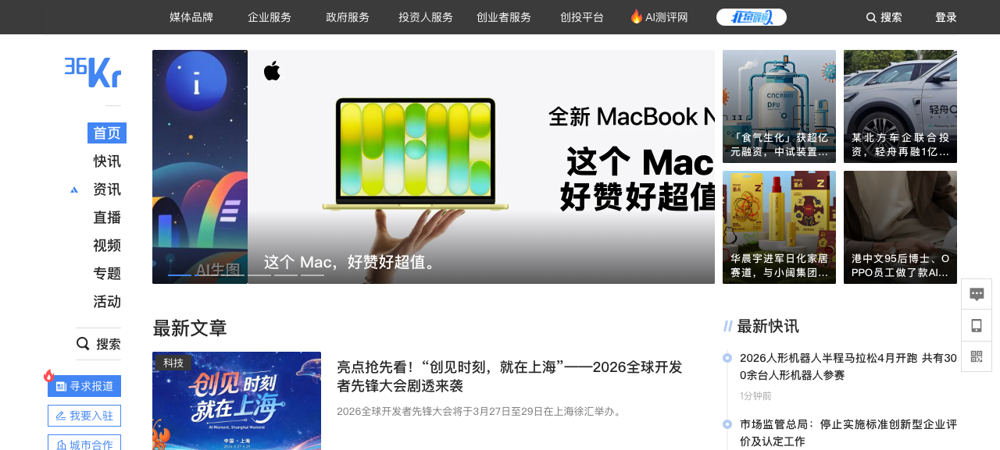

# 新闻来源

Charles 推荐的高质量新闻来源分类列表

## 1. 深度商业与财经

这些来源以深度调查、专业分析和市场实时数据见长：

- **财新网 (Caixin)**：国内公认的深度财经媒体，其采编团队在一线调查和政经分析方面具有极高专业性

  

- **彭博社 (Bloomberg)**：全球商业与金融信息的权威，提供详尽的市场数据和商业评论
- **华尔街日报 (The Wall Street Journal)**：提供高质量的国际经济走势和政策分析
- **经济学人 (The Economist)**：侧重于全球政经形势的深度解读，文风独特且视角宏大

## 2. 权威综合与国际时政

了解国内外重大事件的动态：

- **新华社 / 央视新闻**：了解中国官方政策动向、重大活动和国家立场的核心来源
- **美联社 (AP) 与路透社 (Reuters)**：全球最大的两家通讯社，新闻报道以中立、客观和快速著称，是全球媒体的重要发源地
- **BBC News**：提供广泛的国际报道，其调查性新闻和科学技术板块非常有价值

  

- **纽约时报 (The New York Times)**：在国际政经、文化和社会评论方面具有极强的全球影响力

## 3. 新闻聚合与效率工具

在一个地方看到多方观点或定制化内容：

- **Google News**：自动聚合全球各大媒体报道，方便对比不同立场对同一事件的描述
- **Flipboard**：以杂志化的排版整合社交媒体和新闻网站，适合碎片化阅读
- **RSS 阅读器 (如 Feedly, Inoreader)**：通过订阅网站的 RSS 源，可以彻底摆脱算法推荐，精准获取自己选定的内容（如知乎热榜、少数派、技术博客等）

## 4. 科技与专业垂直

- **36氪 / 钛媒体**：关注国内互联网大厂动态、创投圈和前沿科技趋势

  

- **Solidot**：专注于技术和科学领域的奇客新闻
- **少数派 (sspai)**：侧重于高效数字生活和软硬件工具的应用

---

*更新时间：2026-03-23*
