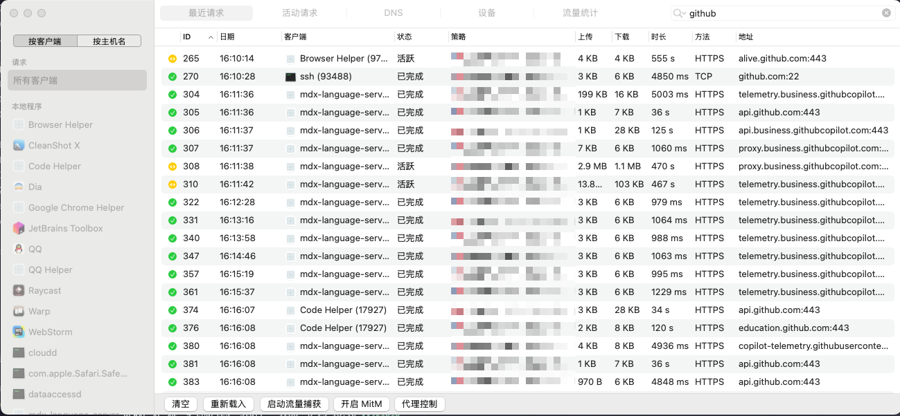
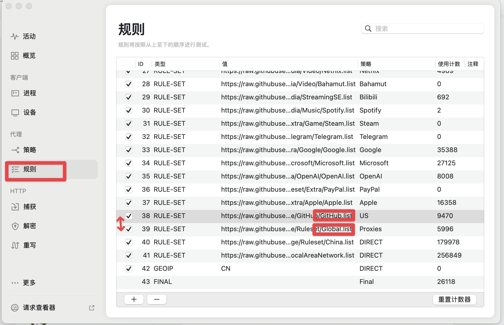

## 背景

在 surge 的自定义策略组中，我设置了 github 策略组，并且设置了一个默认的策略组为 `github`，用于将所有 github 所有数据走当前的策略组。

而我将此策略组模式选择了 US 策略，以告之当前机器的 github 全部流量走 US 节点。

## 问题

问题在于我设置了 US 节点，但是没有任何作用，通过查看器观察到的流量还是走的默认节点。

## 分析

经过分析，发现 surge 的策略组是自上而下穿透的，因此需要将 github 策略组放在全局策略组之前。

