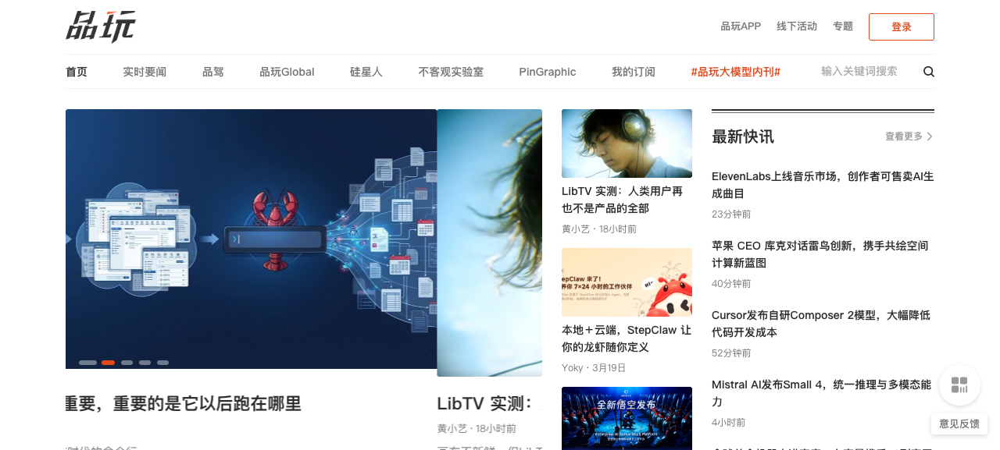

## 📰 每周速闻 - 2026-03-20

本期摘要：本周科技界动态纷呈，稀宇科技发布MiniMax-M2.7大模型，Cursor推出自研Composer 2模型显著降低代码开发成本。国际方面，Jeff Bezos计划筹集千亿美元用AI改造传统制造业，Nothing CEO大胆预测智能手机应用将被AI Agent取代。AI技术层面，Google实现多模态统一，Gamma新增图像生成工具挑战Adobe，行业正处于深度变革期。

---

## 📰 本周新闻来源

---

## 🇨🇳 国内动态

### 少数派

#### [派早报：小米发布多款新品、稀宇科技发布 MiniMax-M2.7 模型](https://sspai.com/post/107563)
**来源**: [少数派](https://sspai.com)
**发布时间**: 2026-03-20

**简介**:
本周小米召开新品发布会，推出多款硬件产品，涵盖手机、IoT等多个品类。与此同时，稀宇科技（MiniMax）发布了最新的M2.7大语言模型。MiniMax-M2.7在推理效率和多模态处理能力上有显著提升，专注于为企业和开发者提供更强的大模型服务。此次更新进一步缩小了与国际顶尖模型的差距，在中文理解和生成能力上表现优异，适合智能客服、内容创作等应用场景。

---

#### [派早报：腾讯 QClaw 正式上线、小鹏 P7 发布 Max 版](https://sspai.com/post/107514)
**来源**: [少数派](https://sspai.com)
**发布时间**: 2026-03-19

**简介**:
腾讯正式上线QClaw平台，这是腾讯在AI协作领域的重要布局。QClaw旨在提升团队协作效率，集成AI辅助功能，支持文档编辑、项目管理等多种场景。与此同时，小鹏汽车发布P7 Max版，新车型在智能驾驶和座舱体验上进行了全面升级，搭载最新版本的XNGP智能驾驶系统，续航里程和充电速度均有提升，进一步巩固其在智能电动车市场的竞争力。

---

#### [Notion 年度更新评测：7 个案例聊聊 Custom Agent](https://sspai.com/post/106878)
**来源**: [少数派](https://sspai.com)
**发布时间**: 2026-03-20

**简介**:
Notion在其年度更新中推出了Custom Agent功能，允许用户根据特定需求定制AI助手。本文通过7个实际案例，详细评测了Custom Agent在不同场景下的表现，包括项目管理、文档总结、数据分析等。评测显示，Custom Agent在定制化程度和任务执行效率上表现突出，但学习曲线相对较陡峭。对于重度Notion用户而言，这是一个强大的生产力工具，能够显著提升工作流效率。

---

### PingWest 品玩

#### [苹果 CEO 库克对话雷鸟创新，携手共绘空间计算新蓝图](https://www.pingwest.com/a/312096)
**来源**: [品玩](https://www.pingwest.com)
**发布时间**: 2026-03-20

**简介**:
苹果CEO蒂姆·库克与雷鸟创新团队在北京展开深度对话，双方就空间计算（Spatial Computing）的未来发展交换了意见。雷鸟创新作为国内AR眼镜领域的领先企业，在硬件设计和用户体验上积累了丰富经验。此次对话被视为苹果在XR生态上的重要布局，可能预示着双方在未来的合作机会，共同推动空间计算技术的普及和应用场景的拓展。

---

#### [LibTV 实测：人类用户再也不是产品的全部](https://www.pingwest.com/a/312278)
**来源**: [品玩](https://www.pingwest.com)
**发布时间**: 2026-03-20

**简介**:
LibTV是一款创新的视频内容平台，其特点是内容不仅为人类用户服务，也面向AI Agent。实测发现，LibTV的内容结构经过特殊设计，AI可以高效地理解和索引这些内容，为用户提供个性化推荐。这意味着，未来的内容消费可能不再局限于人类直接浏览，AI Agent将成为重要的"中介"。LibTV的探索为"AI原生"内容生态提供了新的思路。

---

#### [AI 手机的「从尝鲜到常用」：OPPO 在赌一件比点咖啡更难的事](https://www.pingwest.com/a/312145)
OPPO在AI手机领域投入巨大，目标是让AI功能从"尝鲜"变成"常用"。然而，这比点咖啡还难——因为用户习惯需要长期培养，而且AI功能必须真正解决用户的实际问题。OPPO Find N6搭载了最新的AI芯片和深度定制的ColorOS AI系统，提供实时翻译、智能摘要、图像增强等功能。OPPO的赌注在于，如果AI手机能够成功普及，将彻底改变用户的交互方式和手机厂商的商业模式。

---

## 🌍 国际动态

### TechCrunch

#### [Jeff Bezos reportedly wants $100 billion to buy and transform old manufacturing firms with AI](https://techcrunch.com/2026/03/19/jeff-bezos-reportedly-wants-100-billion-to-buy-and-transform-old-manufacturing-firms-with-ai/)
**来源**: [TechCrunch](https://techcrunch.com)
**发布时间**: 2026-03-20

**简介**:
据报道，亚马逊创始人杰夫·贝佐斯计划筹集1000亿美元，用于收购和改造传统制造业企业。贝佐斯的策略是利用AI技术提升这些企业的运营效率、优化供应链、并开发新产品。这笔投资规模惊人，显示出贝佐斯对AI改造传统行业的强烈信心。如果计划成功，将重塑制造业的格局，可能催生一批"AI驱动"的工业巨头。

---

#### [Online bot traffic will exceed human traffic by 2027, Cloudflare CEO says](https://techcrunch.com/2026/03/19/online-bot-traffic-will-exceed-human-traffic-by-2027-cloudflare-ceo-says/)
**来源**: [TechCrunch](https://techcrunch.com)
**发布时间**: 2026-03-19

**简介**:
Cloudflare CEO马修·普林斯预测，到2027年，在线机器人流量将超过人类流量。这一预测基于当前AI Agent、爬虫和自动化工具的快速普及。普林斯指出，这既是机遇也是挑战——企业需要优化网站以适应机器访问，同时也要加强安全防护，防止恶意机器人的攻击。这一转变将深刻影响互联网生态，从内容分发到广告投放都可能重新定义。

---

#### [Meta rolls out new AI content enforcement systems while reducing reliance on third-party vendors](https://techcrunch.com/2026/03/19/meta-rolls-out-new-ai-content-enforcement-systems-while-reducing-reliance-on-third-party-vendors/)
**来源**: [TechCrunch](https://techcrunch.com)
**发布时间**: 2026-03-19

**简介**:
Meta推出了新的AI内容执行系统，旨在更高效地管理平台内容，同时减少对第三方供应商的依赖。新系统使用自研的AI模型，能够实时识别和标记违规内容，包括仇恨言论、虚假信息、暴力内容等。Meta表示，这将提高内容审核的准确性和响应速度，同时降低成本。然而，外界对AI审核的透明度和潜在偏见仍有担忧。

---

#### [DoorDash launches a new 'Tasks' app that pays couriers to submit videos to train AI](https://techcrunch.com/2026/03/19/doordash-launches-a-new-tasks-app-that-pays-couriers-to-submit-videos-to-train-ai/)
**来源**: [TechCrunch](https://techcrunch.com)
**发布时间**: 2026-03-18

**简介**:
外卖平台DoorDash推出了一款名为"Tasks"的新应用，付费邀请外卖员提交视频，用于训练其AI系统。这些视频可能包含外卖员的工作场景、配送路线、客户互动等内容。DoorDash表示，这将帮助优化配送算法和提升服务体验。但这一做法也引发了隐私和伦理方面的讨论——外卖员是否知情？数据如何使用？这些问题仍待明确。

---

#### [Nvidia is quietly building a multibillion-dollar behemoth to rival its chips business](https://techcrunch.com/2026/03/18/nvidia-networking-division-building-a-multibillion-dollar-behemoth-to-rival-its-chips-business/)
**来源**: [TechCrunch](https://techcrunch.com)
**发布时间**: 2026-03-20

**简介**:
英伟达正在悄然打造一个价值数十亿美元的新业务线，旨在与其核心芯片业务形成互补。虽然具体细节尚未公开，但分析师推测，这可能涉及云计算、AI服务或软件平台等领域。如果成功，英伟达将从一家硬件公司转型为"硬+软"的综合AI解决方案提供商，进一步增强其市场护城河。这一动向值得关注，因为它可能改变AI产业的竞争格局。

---

## 🤖 AI 技术进展

#### Gamma adds AI image-generation tools in bid to take on Canva and Adobe
**来源**: [TechCrunch](https://techcrunch.com)
**发布时间**: 2026-03-19

**简介**:
演示文稿工具Gamma新增了AI图像生成功能，直接向Canva和Adobe发起挑战。用户只需输入文字描述，Gamma就能自动生成匹配的插图、图表和设计元素。这些图像不仅美观，而且与演示文稿的主题和风格保持一致。Gamma的这一举措进一步降低了设计门槛，让非专业用户也能快速创建高质量的视觉内容。Canva和Adobe预计将面临更大的竞争压力。

---

#### Patreon CEO calls AI companies' fair use argument 'bogus,' says creators should be paid
**来源**: [TechCrunch](https://techcrunch.com)
**发布时间**: 2026-03-18

**简介**:
Patreon CEO在公开场合批评AI公司的"合理使用"（Fair Use）论点是"虚假的"。他指出，AI模型在训练过程中大量使用了创作者的内容，但这些创作者从未获得报酬。Patreon呼吁建立更公平的内容授权机制，确保创作者能够从AI的使用中受益。这一观点得到了许多创作者和版权组织的支持，AI公司正面临越来越大的道德和法律压力。

---

#### Mistral bets on 'build-your-own AI' as it takes on OpenAI, Anthropic in enterprise
**来源**: [TechCrunch](https://techcrunch.com)
**发布时间**: 2026-03-20

**简介**:
Mistral AI在企业AI市场采取了差异化策略，主打"自建AI"（build-your-own AI）。相比于直接提供预训练的模型，Mistral更倾向于帮助企业基于其平台定制和训练专属模型。这一策略降低了企业对OpenAI和Anthropic的依赖，同时也保护了数据隐私。Mistral表示，企业级AI市场需要的是灵活性和可控性，而非"一刀切"的解决方案。

---

#### Rebel Audio is a new AI podcasting tool aimed at first-time creators
**来源**: [TechCrunch](https://techcrunch.com)
**发布时间**: 2026-03-19

**简介**:
Rebel Audio是一款面向首次创作者的AI播客制作工具。它利用AI技术，帮助用户快速完成播客的各个环节：从脚本生成、音频录制、到后期编辑和分发。Rebel Audio特别适合那些有想法但缺乏技术背景的创作者，大大降低了播客制作的门槛。工具还提供AI驱动的声音优化和音乐推荐，让播客听起来更加专业。随着播客市场的持续增长，此类工具有望吸引更多创作者入场。

---

## 📊 行业趋势

### AI Agent 正在崛起

本周有多条新闻指向同一个趋势：AI Agent（智能代理）正在成为新的交互范式。

- **Nothing CEO 的预测**：智能手机应用将被AI Agent取代
- **LibTV 的探索**：内容不仅为人类服务，也为AI Agent优化
- **Google 的多模态统一**：为AI Agent理解复杂世界打下基础

这意味着，未来的用户体验可能从"打开应用完成任务"转变为"告诉AI Agent需求，让Agent自主调用服务"。这一转变将对应用生态、商业模式和用户习惯产生深远影响。

### 多模态融合成为共识

Google、Mistral等公司在多模态技术上取得进展：

- **Google**：将文本、图片、视频、音频、PDF统一到同一向量空间
- **Mistral Small 4**：统一推理与多模态能力

多模态融合是AI发展的必经之路，它使AI能够像人类一样，通过多种感官理解世界。这将为图像搜索、内容创作、教育培训等领域带来新的可能。

### 企业级 AI 落地加速

多家企业在AI工具和平台上的投入加大：

- **腾讯 QClaw**：AI协作平台正式上线
- **Notion Custom Agent**：定制化AI助手提升生产力
- **Cursor Composer 2**：降低代码开发成本
- **钉钉升级"悟空"**：AI驱动企业协作

这些工具的共同点是聚焦于实际应用场景，解决企业真实痛点，而非单纯展示技术实力。这表明AI已经从"炫技"阶段进入"务实"阶段。

### AI 与传统行业的结合加速

- **贝佐斯的千亿美元计划**：用AI改造传统制造业
- **OPPO 的AI手机**：从尝鲜走向常用
- **小鹏 P7 Max**：智能驾驶能力升级

AI不再局限于互联网和科技行业，而是深入到制造、汽车、金融等传统领域。这种融合将催生新的商业模式和就业机会，同时也带来转型期的挑战。

### 内容生态面临重构

- **Patreon 的声音**：批评AI公司的"合理使用"论点，呼吁创作者获得报酬
- **Meta 的新系统**：AI内容审核减少对第三方的依赖
- **DoorDash 的Tasks**：付费收集用户视频训练AI

这些事件反映了内容生态的矛盾与调整：AI既能高效生产内容，也可能侵犯创作者权益；AI可以审核内容，但透明度存疑；AI需要训练数据，但数据获取方式引发争议。未来，内容生态需要在效率、公平和隐私之间找到平衡。

---

## 🎯 重点关注

### OpenAI 与军方合作引发争议

本周有报道指出，OpenAI 正在与AWS合作，扩大其政府业务。与此同时，美国国防部表示，Anthropic的某些政策"红线"构成"国家安全风险"。这反映出AI公司在政府合作上的两难境地：一方面，政府是重要的客户和市场；另一方面，与军方的合作可能引发伦理争议。AI公司需要谨慎定义自己的"红线"，避免损害公众信任。

### AI 的性别平等问题

Rana el Kaliouby（Affectiva创始人）警告，AI行业的"男孩俱乐部"可能扩大女性的财富差距。她指出，AI公司的高层和技术团队中男性占主导地位，这导致AI产品可能忽视女性需求，同时也影响女性的职业发展。解决这一问题需要从招聘、晋升、文化建设等多方面入手，推动AI行业的多样性。

### AI 在电商的应用探索

DoorDash推出的Tasks应用，展示了AI在电商和O2O服务中的一种应用方向：通过收集用户生成内容（视频）来训练AI，优化服务。这种模式具有潜力，但也需要解决隐私、透明度和用户授权等问题。未来，我们可能会看到更多类似的AI应用场景，从外卖出行到零售金融。

---

## 📌 本期总结

本周科技/AI领域动态密集，核心趋势可以概括为：

1. **AI Agent 范式崛起** - 应用形态可能发生根本性改变
2. **多模态技术突破** - Google、Mistral统一多模态处理
3. **企业级 AI 加速落地** - 钉钉、Notion、Cursor等工具聚焦务实场景
4. **AI 改造传统行业** - 贝佐斯计划用AI重塑制造业
5. **内容生态重构进行时** - Patreon、Meta、DoorDash探索新模式

下周我们将继续关注这些趋势的发展，特别是AI Agent的落地应用和多模态技术的商业化进展。

---

*图片来源：少数派、品玩、TechCrunch 首页截图*
*新闻来源：少数派、品玩、TechCrunch*
